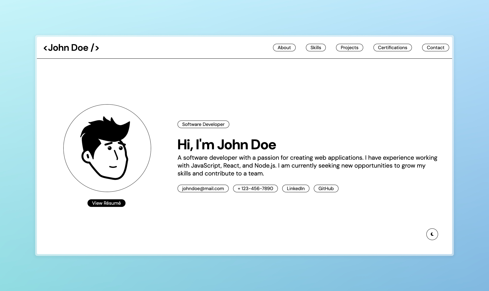

# Edgefolio: A Minimal & Responsive Student Portfolio

A modern, responsive portfolio template built with React JS, designed to showcase skills, projects, and achievements effectively. This template provides a clean and minimalistic design suitable for students and developers.

[](https://sandeepruttala.github.io/edgefolio/)


## 🌐 Live Demo
Check out the live version: [https://sandeepruttala.github.io/edgefolio/](https://sandeepruttala.github.io/edgefolio/)

## ✨ Features
- **Responsive Design**: Optimized for mobile and desktop views.
- **Easy Customization**: Modify data to fit your personal profile just by changing function parameters or props.
- **Dark Mode**: Dark Mode Available.
- **React Components**: Organized code structure for quick editing and expansion.
- **Dynamic Project Showcase**: Easily add and manage project entries.

## 📂 Project Structure
Here's a quick overview of the key files and folders:
- `public/` - Contains static files and images.
- `src/` - Main React code with component files and styling.
  - `components/` - Reusable components (Header, About, Projects, etc.)
  - `App.js` - Main app component where the layout is structured.
  - `index.js` - Entry point for the React app.

## 🛠️ Installation

1. Clone the repository:
   ```bash
   git clone https://github.com/sandeepruttala/edgefolio.git
   ```
2. Navigate into the project directory:
   ```bash
   cd edgefolio
   ```
3. Install dependencies:
   ```bash
   npm install
   ```
4. Run the development server:
   ```bash
   npm start
   ```

## 📋 Usage
Customize the content in the `src/components/` folder. Update information each section (like `About`, `Projects`, etc.) by changing function parameters or props to reflect your personal information and achievements.

## 🚀 Deployment
To deploy this portfolio on platforms like GitHub Pages or Vercel:

1. Build the project:
   ```bash
   npm run build
   ```
2. Follow the platform-specific instructions for deployment.

## Contact Form API
The contact form in this template uses [Formspree](https://formspree.io/) to send emails. To receive form submissions, you need to set up your Formspree account and update the form endpoint in the `Components/Contact.jsx` file.

## 🤝 Contributing
Feel free to open issues or submit pull requests if you have suggestions for improvements.
