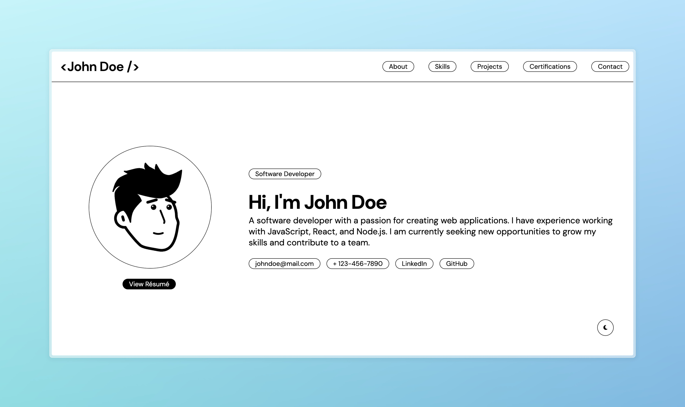

# Edgefolio: A Minimal & Responsive Student Portfolio

A modern, responsive portfolio template built with React JS, designed to showcase skills, projects, and achievements effectively. This template provides a clean and minimalistic design suitable for students and developers.

[](https://sandeepruttala.github.io/edgefolio/)

## 🌐 Live Demo

Check out the live version: [https://sandeepruttala.github.io/edgefolio/](https://sandeepruttala.github.io/edgefolio/)

## ✨ Features

- **Responsive Design**: Optimized for mobile and desktop views.
- **Easy Customization**: Modify data to fit your personal profile just by changing function parameters or props.
- **Dark Mode**: Dark Mode Available.
- **React Components**: Organized code structure for quick editing and expansion.
- **Dynamic Project Showcase**: Easily add and manage project entries.

## � Quick Start

Make your portfolio yours **in seconds**:

1. Open `/public/data.json`
2. Update your information:
   - Your name, role, description
   - Email, phone, LinkedIn, GitHub links
   - Education, interests, hobbies
   - Skills by category
   - Projects and certifications
3. Save the file - your portfolio updates instantly!

**No coding needed!** Just edit the JSON file and watch your portfolio transform.

## 📂 Project Structure

Here's a quick overview of the key files and folders:

- `public/` - Contains static files and images.
  - `data.json` - **Your portfolio data** - Edit this to customize everything!
- `src/` - Main React code with component files and styling.
  - `components/` - Reusable components (Header, About, Projects, etc.)
  - `App.jsx` - Main app component where the layout is structured.
  - `index.js` - Entry point for the React app.

## 🛠️ Installation

1. Clone the repository:
   ```bash
   git clone https://github.com/sandeepruttala/edgefolio.git
   ```
2. Navigate into the project directory:
   ```bash
   cd edgefolio
   ```
3. Install dependencies:
   ```bash
   npm install
   ```
4. Run the development server:
   ```bash
   npm run dev
   ```
5. Open your browser and go to `http://localhost:3000/edgefolio/`

## 📋 Usage

Customize your portfolio in seconds:

1. **Edit your data**: Open `public/data.json` and update all your information
2. **See changes instantly**: The site updates automatically every 5 seconds during development
3. **No code changes needed**: All portfolio content comes from `data.json`

Check out [DATA_MANAGEMENT.md](DATA_MANAGEMENT.md) for detailed examples and structure information.

## 🚀 Deployment

To deploy this portfolio on GitHub Pages:

1. The `homepage` and deployment scripts are already configured in `package.json`

2. Deploy the project to GitHub Pages:
   ```bash
   npm run deploy
   ```

3. Your portfolio will now be live at `https://<your-github-username>.github.io/edgefolio/`

**Note**: Make sure to update your data in `public/data.json` before deploying for the best results!

## Contact Form API

The contact form in this template uses [Formspree](https://formspree.io/) to send emails. To receive form submissions, you need to set up your Formspree account and update the form endpoint in the `Components/Contact.jsx` file.

## 🤝 Contributing

Feel free to open issues or submit pull requests if you have suggestions for improvements.
